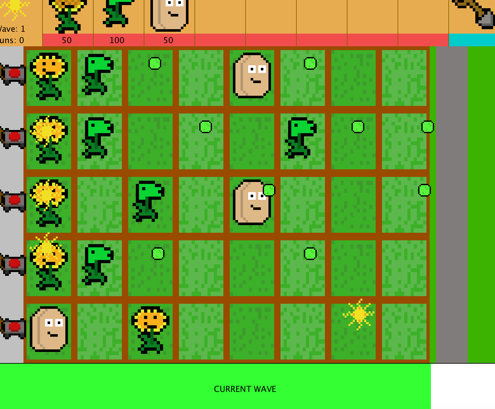
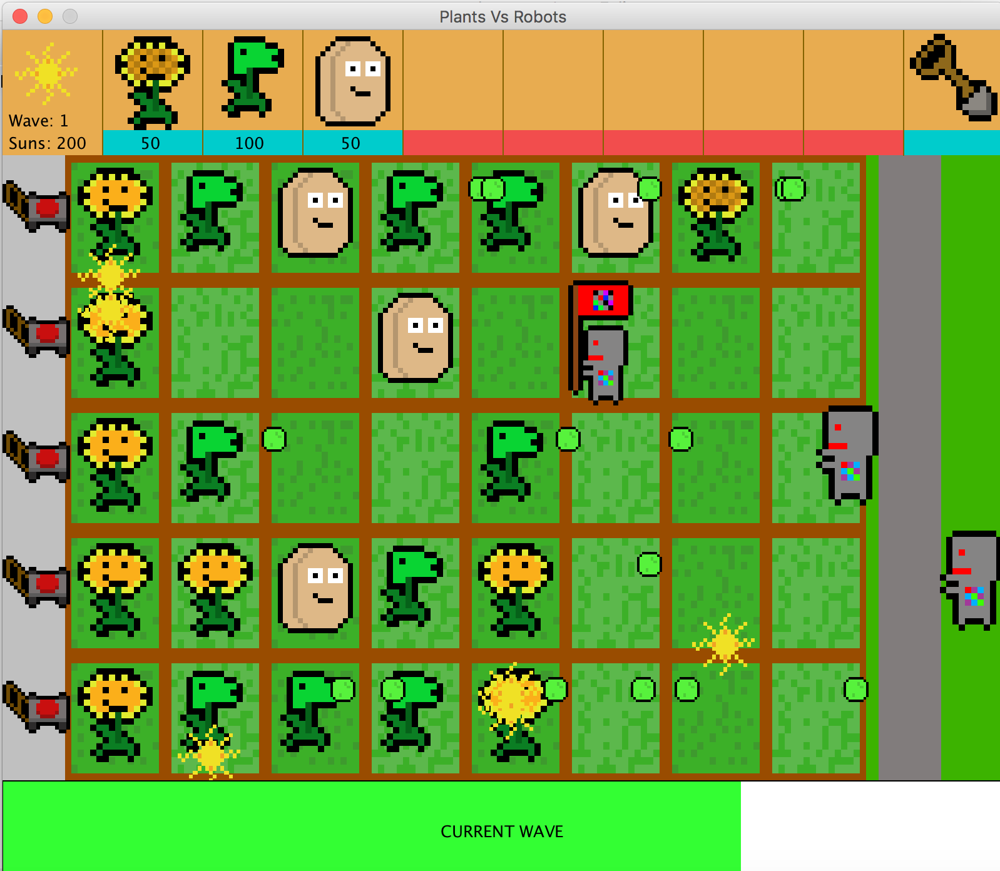

# Plants Vs Robots

This is a game created in Java for a semester 2 final project in AP Computer Science.

## Rules:

This game plays similar to Plants Vs Zombies, where players must fight against waves of robots using plants that they must plant in a grid of plantable spots.

1. Use suns to purchase plants.
2. Use shovel to dig up plants that you may have misplaced.
3. Sunflowers produce sun faster, Peashooters shoot Peas, and Walnuts provide time for the player by being a Wall

## Screenshot

